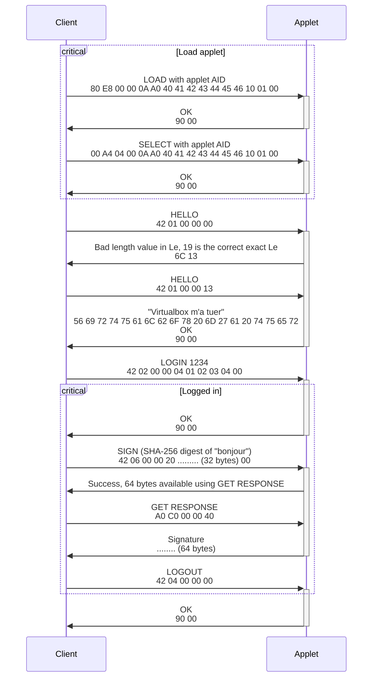

# Projet de sécurité / IoT

Documentation des composants :

## [Applet JavaCard](card)

## [Clients Python](client_python)

## Rapport de développement

Nous sommes partis de l'exemple Hello World fourni, et avons commencé par mettre en place une architecture de code
permettant de gérer plusieurs instructions (décodage du champ `INS`, appel de la fonction correspondante). De là, nous
avons pu implémenter la gestion du code PIN et de l'authentification ; faute d'une documentation correcte
pour `OwnerPIN`, nous avons pu nous inspirer
de [ce projet](https://github.com/Toporin/SatochipApplet/blob/master/src/org/satochip/applet/CardEdge.java).
Concrètement, un objet `OwnerPIN` est stocké de manière persistante dans l'applet et fournit les fonctionnalités
usuelles d'un PIN (vérifier, gérer le nombre d'essais restant avant blocage, modifier).

Pour le chiffrement, nous avons pu utiliser les classes du package `javacard.security` qui correspond plus ou moins aux
classes disponibles sur bureau dans `javax.crypto`. Un objet `KeyPair` est instancié lors de la [ré]initialisation de
l'applet, et est stocké de manière persistante. Cependant, ce package ne supporte pas le hachage SHA-256, celui-ci est
donc effectué côté client (ce qui ne change rien à la validité du processus). Côté carte, la charge à signer est
construite à partir du hash transmis et de l'identifiant ASN.1 pour le SHA-256, et le tout est chiffré avec la clé
privée pour aboutir à une signature.

Le client a été développé en tandem avec l'applet, et les tests se faisaient ainsi via l'envoi des APDUs à tester depuis
le REPL du client. L'utilitaire `openssl` sur ordinateur a été utilisé pour s'assurer que les signatures étaient
correctement générées et valides (en effet, on peut vérifier avec `openssl` une signature générée par la carte, et ça
fonctionne).

### Détail des APDUs

Toutes les communications avec l'applet se font en T=0.

| `INS` | Description                             | Entrée      | Sortie           | Authentifié |
|-------|-----------------------------------------|-------------|------------------|-------------|
| `01`  | Renvoie un message stocké dans la carte |             | Message          |             |
| `02`  | S'authentifie dans la carte             | PIN (4 o)   |                  |             |
| `03`  | Modifie le PIN                          | PIN (4 o)   |                  | Oui         |
| `04`  | Se désauthentifie de la carte           |             |                  | Oui         |
| `05`  | Réinitialise le PIN et la paire de clés |             |                  |             |
| `06`  | Signe le hash SHA-256 fourni            | Hash (32 o) | Signature (64 o) | Oui         |
| `07`  | Renvoie la clé publique                 |             | Clé publique     |             |
| `08`  | Renvoie la clé privée                   |             | Clé privée       | Oui         |

#### Format de la clé publique

| Position      | Taille    | Description                      |
|---------------|-----------|----------------------------------|
| 0             | 2         | Longueur de l'exposant (`e_len`) |
| 2             | `e_len`   | Exposant                         |
| 2 + `e_len`   | 2         | Longueur du module (`n_len`)     |
| 4 + `e_len`   | `n_len`   | Module                           |

Le couple (e, n) décrit la clé publique et permet de chiffrer des données.

#### Format de la clé privée

| Position    | Taille   | Description               |
|-------------|----------|---------------------------|
| 0           | 2        | Longueur de `p` (`p_len`) |
| 2           | `p_len`  | `p`                       |
| 2 + `p_len` | 2        | Longueur de `q` (`q_len`) |
| 4 + `p_len` | `q_len`  | `q`                       |

Les clés privées RSA sont usuellement décrites via le nombre `d` défini comme `d = e^-1 mod (p-1)(q-1)`. Cependant,
l'API JavaCard ne permet pas d'obtenir `d` directement, et le calculer sur la carte est coûteux en ressources (en
outre, `BigInteger` n'est pas disponible sur la carte). Nous récupérons donc `p` et `q`, que JavaCard expose, et nous
calculons `d` côté client à partir de la clé publiqu et la clé privée à l'aide de la formule citée plus tôt.

### Exemple de communication

